<table>
<tr>
<td valign="top"></td>
<td valign="top"></td>
</tr>
</table>

## Omar Khaled

**Founder & AI Engineer — Production Multi-Agent Systems & Full-Stack AI**

 

<!-- Animated contribution graph, refreshed daily by GitHub Actions. -->

